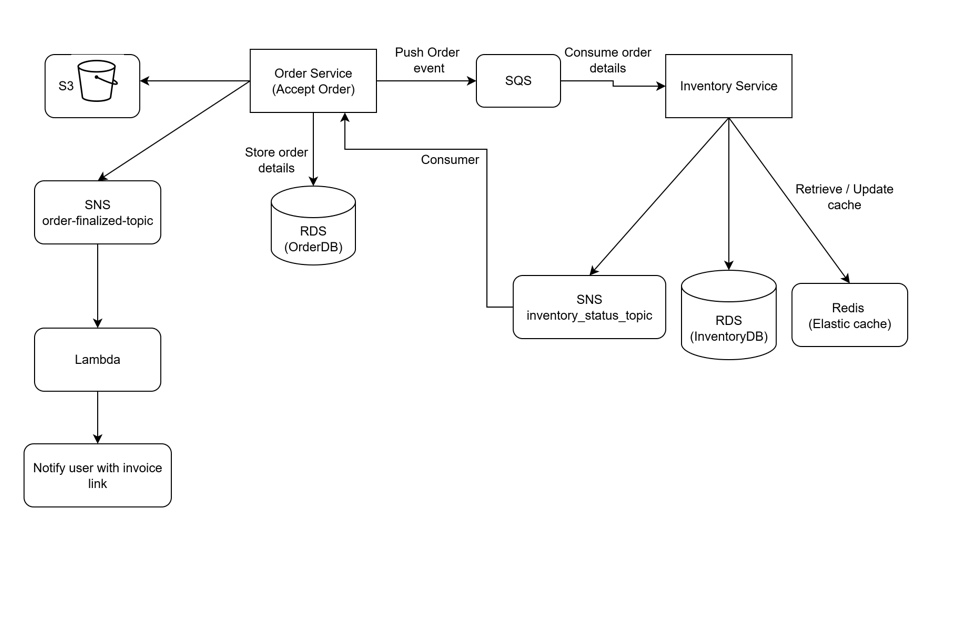

# 🛒 NimbusCart

**NimbusCart** is a cloud-native, event-driven order processing system built using microservices. It demonstrates how to design, deploy, and scale resilient services on AWS using infrastructure as code (Terraform).

The system handles product orders, inventory management, invoice generation (PDFs stored in S3), and asynchronous event-driven communication using SQS and Lambda. It ensures high availability, multi-AZ deployment, and modular architecture using Node.js, Python, PostgreSQL, and Redis.

---

## End to end flow

1. User places order → Order Service
2. Order is stored in OrderDB
3. Order event pushed to SQS
4. Inventory Service consumes order:
   - Updates InventoryDB
   - Updates Redis
   - Publishes status to order_status_topic

5. Order Service waits for status

6. Order Service:
   - Generates invoice
   - Uploads to S3

7. Order Service publishes order-finalized-topic
8. Lambda receives FINALIZED_ORD, sends notification with invoice link

## Component Diagram

